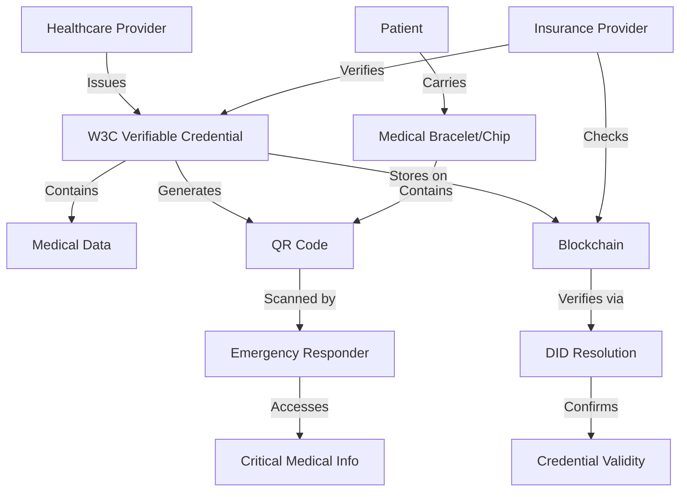

# Dynamic Scoliosis Credentials System

[](https://python.org)
[](https://opensource.org/licenses/MIT)
[](./tests/)

> A life-saving digital credential system for Dynamic Scoliosis practitioners and patient emergency records

Professional healthcare infrastructure enabling physicians worldwide to establish verifiable Dynamic Scoliosis credentials on blockchain while providing emergency responders instant access to critical patient information via QR codes.

## 🚨 CRITICAL: This Can Save Lives

**For Emergency Responders:** Patient QR codes contain vital medical information including:
- **Blood type and allergies** - Critical for immediate treatment decisions
- **Current medications** - Prevents dangerous drug interactions  
- **Medical devices** - Alerts to pacemakers, implants, or scoliosis braces
- **Emergency contacts** - Immediate family notification
- **Primary physician** - Expert consultation access

**For Healthcare Providers:** Verifiable credentials establish trust and expertise in Dynamic Scoliosis treatment, enabling:
- **Cross-border practice** - International credential verification
- **Patient confidence** - Verified training and specialization levels
- **Insurance acceptance** - Documented certification for coverage
- **Emergency treatment** - Quick verification of treating physician qualifications

---

## Table of Contents

### Getting Started
- [Installation](#installation)
- [Quick Start Guide](#quick-start-guide)
- [CLI Reference](#cli-reference)

### Documentation
- [Emergency Response Scenarios](docs/EMERGENCY_SCENARIOS.md)
- [User Guide](docs/USER_GUIDE.md)  
- [API Reference](docs/API_REFERENCE.md)
- [Configuration Guide](docs/CONFIGURATION.md)

### Real-World Applications
- [Healthcare Provider Setup](docs/PROVIDER_SETUP.md)
- [Patient Record Management](docs/PATIENT_RECORDS.md)
- [International Credential Recognition](docs/INTERNATIONAL_USE.md)

### Development
- [Contributing Guidelines](docs/CONTRIBUTING.md)
- [Testing](docs/TESTING.md)
- [Security Considerations](docs/SECURITY.md)

---

## Who This System Serves

### Healthcare Providers
- **International practitioners** seeking verified training certification
- **Medical institutions** implementing credential verification systems
- **Insurance providers** requiring documented qualifications

### Emergency Responders
- **EMT/Paramedic teams** needing instant patient medical information
- **Emergency room staff** treating unconscious patients
- **Medical alert systems** for critical condition management

### Healthcare Institutions
- **Hospitals** implementing patient identification systems  
- **Clinics** managing practitioner credentials
- **Medical schools** issuing verified certifications
- **Blockchain healthcare platforms** requiring W3C compliance

---

## Quick Start Guide

### Installation

```bash
# Install from source
git clone https://github.com/Frajder/dynamic_scoliosis.git
cd dynamic_scoliosis
pip install -e .
```

### Generate Your First Credential

```bash
# Interactive mode (recommended for first-time users)
ds-credentials generate

# Quick practitioner credential
ds-credentials generate \
  --type practitioner \
  --name "Dr. Kim Johnson" \
  --issuer "did:web:kim-clinic.example"

# Patient emergency record
ds-credentials generate \
  --type patient_record \
  --name "Kim Johnson" \
  --issuer "did:web:hospital.example"
```

### Validate & View Credentials

```bash
# Validate a credential
ds-credentials validate output/credential.json

# View credential summary
ds-credentials summary output/credential.json

# Decode QR code payload
ds-credentials decode-qr "VC:eyJhbGciOiJFZE..."
```

---

## Life-Saving Use Cases

### Case 1: Emergency Room Response

**Scenario:** Kim Johnson, a Dynamic Scoliosis patient, is brought unconscious to the ER after a car accident.

**Life-Saving Action:** 
1. EMT scans QR code on Kim's medical bracelet
2. Instantly reveals: **Blood type B+**, **Codeine allergy**, **Scoliosis brace**
3. Prevents life-threatening allergic reaction to standard pain medication
4. Alerts surgeon to spinal hardware before procedures

**Implementation:**
```bash
# Generate emergency patient record
ds-credentials generate \
  --type medical_alert \
  --config emergency_config.json
```

### Case 2: Physician Credential Verification

**Scenario:** Dr. Kim establishes Dynamic Scoliosis practice after relocating internationally.

**Professional Success:**
1. Generates verifiable W3C credential proving medical training
2. Blockchain-based verification prevents credential fraud
3. Insurance companies accept verified training documentation
4. Patients trust demonstrated expertise levels

**Implementation:**
```bash
# Generate practitioner credential
ds-credentials generate \
  --type practitioner \
  --config kim_practitioner.json \
  --qr
```

### Case 3: Cross-Border Medical Consultation

**Scenario:** Emergency scoliosis case requires expert consultation across time zones.

**Medical Collaboration:**
1. Local physician scans patient QR code for complete medical history
2. Shares verifiable credential proving Dynamic Scoliosis specialization  
3. Specialist validates credentials via blockchain verification
4. Secure consultation proceeds with verified expertise confirmation

---

## Security & Privacy Features

### Cryptographic Security
- **W3C Verifiable Credentials** standard compliance
- **Ed25519 digital signatures** for credential integrity
- **DID-based verification** preventing credential forgery
- **Blockchain anchoring** for tamper-proof credential history

### Healthcare Privacy
- **HIPAA-aware design** for patient data protection
- **Selective disclosure** - share only necessary information
- **Encrypted QR payloads** with compression for efficiency
- **Access control** via verification method requirements

### Decentralized Trust
- **No central authority required** for credential verification
- **Distributed trust network** via blockchain infrastructure
- **International compatibility** through W3C standards
- **Offline verification** capability for emergency situations

---

## System Architecture Overview



### Key Components:
- **CredentialGenerator**: Creates W3C-compliant verifiable credentials
- **QRGenerator**: Encodes credentials into scannable QR codes with compression
- **CredentialValidator**: Ensures W3C compliance and medical data integrity
- **CLI Interface**: User-friendly command-line tools for all operations

---

## Configuration Examples

### Practitioner Configuration (Kim's Clinic)
```json
{
  "credential_type": "practitioner",
  "issuer": {
    "did": "did:web:kim-clinic.example",
    "name": "Dr. Kim's Dynamic Scoliosis Training Center",
    "verification_method": "did:web:kim-clinic.example#key-1"
  },
  "subject": {
    "name": "Kim Johnson",
    "email": "kim.johnson@example.com",
    "organization": "Kim's Medical Practice"
  },
  "practitioner": {
    "level": "Certified",
    "training_hours": 120,
    "specializations": ["Dynamic Scoliosis Assessment", "Advanced Treatment Planning"]
  }
}
```

### Patient Emergency Record
```json
{
  "credential_type": "patient_record",
  "issuer": {
    "did": "did:web:kim-hospital.example",
    "name": "Kim Memorial Hospital"
  },
  "subject": {
    "name": "Kim Johnson"
  },
  "patient_record": {
    "patient_id": "KIM001",
    "blood_type": "B+",
    "emergency_contacts": [
      {
        "name": "Alex Kim",
        "relationship": "Spouse",
        "phone": "+1-555-0456"
      }
    ],
    "medical_alerts": [
      {
        "condition": "Dynamic Scoliosis",
        "severity": "medium", 
        "allergies": ["Codeine"]
      }
    ]
  }
}
```

---

## Advanced Features

### Multi-Language Support
- **Unicode support** for international patient names and medical terms
- **Cultural adaptation** for different healthcare systems

### Emergency Integration
- **Hospital EMR integration** via standardized APIs
- **Medical alert systems** with automatic notification
- **Ambulance dispatch systems** with patient pre-arrival data

### Blockchain Platforms
- **Ethereum compatibility** via DID:ETH
- **Hyperledger Fabric** for permissioned healthcare networks  
- **IPFS storage** for distributed credential backup

---

## Contributing

We welcome contributions from healthcare professionals, developers, and security experts. See our [Contributing Guidelines](docs/CONTRIBUTING.md) for detailed information.

### Priority Areas:
- **Medical terminology accuracy** for Dynamic Scoliosis conditions
- **Emergency response workflow** optimization
- **International healthcare standards** compliance
- **Security audit** and penetration testing

---

## License & Compliance

This project is licensed under the **MIT License** - see [LICENSE](LICENSE) for details.

### Healthcare Compliance:
- **HIPAA-aware architecture** (implementation-dependent)
- **GDPR-compatible** data handling practices  
- **Medical device regulation** considerations documented
- **International standards** alignment (W3C, HL7 FHIR)

---

## Important Disclaimers

### Medical Disclaimer
This software is a **technical tool for credential management** and is not intended to replace medical judgment. Always consult qualified healthcare professionals for medical decisions.

### Emergency Use
While designed for emergency scenarios, this system should **supplement, not replace** existing emergency medical protocols. Ensure emergency responders are trained on QR code scanning procedures.

### Demo Signatures
Default configuration uses **demo cryptographic signatures** for testing. **Production deployments must implement proper cryptographic keys** and signature verification.

---

**Made with ❤️ by [Frajder](https://github.com/Frajder)** 