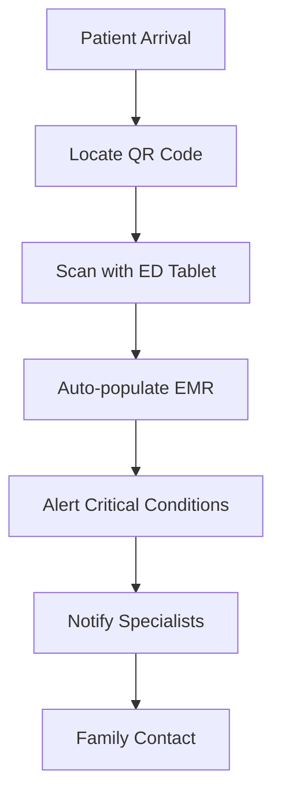

# Emergency Response Scenarios 🚨

> **CRITICAL INFORMATION FOR FIRST RESPONDERS AND EMERGENCY MEDICAL STAFF**

This document provides **life-saving protocols** for using Dynamic Scoliosis credential QR codes in emergency medical situations. Time-sensitive information can mean the difference between life and death.

## Immediate Action Checklist

### Step 1: Locate Patient QR Code (10 seconds)
**Common Locations:**
- Medical alert bracelet or necklace
- Medical ID card in wallet
- Smartphone medical app or lock screen
- Implanted chip (NFC-enabled devices)
- Emergency contact card

**QR Code Appearance:**
- Square black and white pattern
- May be labeled "Medical Alert" or "Emergency Info"
- Often includes medical cross symbol (⚕️)

### Step 2: Scan QR Code (15 seconds)
**Using Standard Equipment:**
```bash
# Most smartphone cameras auto-detect QR codes
# Point camera at QR code and tap notification

# For dedicated QR scanners:
# 1. Open QR scanner app
# 2. Point at code until beep/vibration
# 3. View decoded information
```

### Step 3: Extract Critical Information (30 seconds)
**PRIORITY DATA EXTRACTION:**
1. **Blood Type** - Critical for transfusions
2. **Allergies** - Prevent fatal reactions
3. **Current Medications** - Avoid dangerous interactions
4. **Medical Devices** - Pacemakers, implants, braces
5. **Emergency Contacts** - Family notification

---

## Real Emergency Scenarios

### Scenario 1: Unconscious Patient with Spinal Injury

**Situation:** Kim Johnson, 34F, unconscious after motorcycle accident. Suspected spinal injury.

**Critical Actions:**

**EMT Response (Golden Hour - First 60 minutes):**
```
SCAN QR Code → Medical Bracelet Found
```

**Immediate Discoveries:**
```json
{
  "patient_id": "KIM001",
  "blood_type": "B+",
  "medical_alerts": [
    {
      "condition": "Dynamic Scoliosis with Hardware",
      "severity": "critical",
      "details": "Titanium spinal rods T4-L2",
      "treatment": "DO NOT perform manual spinal manipulation"
    }
  ],
  "allergies": ["Codeine", "Morphine"],
  "emergency_contacts": [
    {
      "name": "Alex Kim",
      "relationship": "Spouse", 
      "phone": "+1-555-0456"
    },
    {
      "name": "Dr. Sarah Lee",
      "relationship": "Spine Specialist",
      "phone": "+1-555-0789"
    }
  ]
}
```

**Life-Saving Decisions:**
1. **SPINAL IMMOBILIZATION**: Use specialized equipment - patient has hardware
2. **PAIN MANAGEMENT**: Avoid morphine/codeine - use alternative analgesics
3. **BLOOD PREPARATION**: Type B+ - contact blood bank immediately
4. **EXPERT CONSULTATION**: Call Dr. Sarah Lee for spinal hardware guidance
5. **FAMILY NOTIFICATION**: Contact spouse Alex Kim

**Critical Warnings:**
- **DO NOT** attempt manual spinal realignment
- **DO NOT** administer opioids without checking alternatives
- **ENSURE** MRI compatibility check before scanning

---

### Scenario 2: Allergic Reaction Emergency

**Situation:** Patient experiencing severe allergic reaction, unable to communicate.

**Immediate QR Scan Reveals:**
```json
{
  "allergies": ["Penicillin", "Shellfish", "Latex"],
  "medical_alerts": [
    {
      "condition": "Severe Anaphylaxis History",
      "severity": "critical",
      "treatment": "EpiPen in purse, Benadryl contraindicated"
    }
  ],
  "current_medications": [
    "Beta-blocker (Propranolol)", 
    "Blood thinner (Warfarin)"
  ]
}
```

**Life-Saving Protocol:**
1. **EPINEPHRINE**: Administer immediately (EpiPen available)
2. **AVOID BENADRYL**: Patient-specific contraindication noted
3. **BLEEDING RISK**: Monitor for hemorrhage due to blood thinners
4. **CARDIAC MONITORING**: Beta-blockers may mask tachycardia

---

### Scenario 3: Cardiac Event with Complex Medical History

**Situation:** 67M patient, cardiac arrest, Dynamic Scoliosis with multiple comorbidities.

**QR Code Emergency Data:**
```json
{
  "medical_devices": [
    "Pacemaker (St. Jude Medical)",
    "Scoliosis Hardware (Titanium rods)"
  ],
  "medical_alerts": [
    {
      "condition": "Severe Kyphoscoliosis", 
      "severity": "critical",
      "treatment": "Difficult airway - use video laryngoscope"
    }
  ],
  "current_medications": [
    "Warfarin 5mg daily",
    "Amiodarone 200mg daily"
  ]
}
```

**Critical Interventions:**
1. **DEFIBRILLATION**: Check pacemaker placement before pad positioning
2. **AIRWAY MANAGEMENT**: Anticipate difficult intubation due to spinal curvature
3. **MEDICATION INTERACTIONS**: Amiodarone affects defibrillation threshold
4. **BLEEDING PRECAUTIONS**: Warfarin increases hemorrhage risk

---

## QR Code Scanning Technology Guide

### Emergency Scanner Apps (Recommended)
```bash
# iOS Emergency Apps
- Apple Health (built-in Medical ID)
- Emergency SOS with QR scanner
- Red Cross Emergency App

# Android Emergency Apps  
- Google Lens (built-in)
- Medical ID Free
- Emergency SOS with scanner

# Dedicated Medical Scanners
- MedAlert Scanner Pro
- Emergency Medical QR
- Hospital-specific apps
```

### Scanning in Poor Conditions
**Low Light Situations:**
- Use smartphone flashlight
- Angle device to reduce glare
- Clean QR code surface if dirty

**Damaged QR Codes:**
- Try multiple angles
- Use digital zoom if available
- Look for backup QR codes on other items

**No Smartphone Available:**
- Look for printed backup cards
- Check patient ID cards
- Contact emergency services for database lookup

---

## Hospital Integration Protocols

### Emergency Department Workflow

**Triage Integration:**


**EMR Auto-Population:**
```python
# Example hospital integration
def process_emergency_qr(qr_payload):
    """Process emergency QR code in hospital system"""
    credential = decode_qr(qr_payload)
    
    # Critical alerts
    if credential.medical_alerts:
        send_alert_to_staff(credential.medical_alerts)
    
    # Blood bank notification
    if credential.blood_type:
        notify_blood_bank(credential.blood_type)
    
    # Specialist consultation
    if credential.primary_physician:
        contact_specialist(credential.primary_physician)
    
    return credential
```

### Trauma Team Activation
**Automatic Triggers from QR Data:**
- Spinal hardware detected → Orthopedic consult
- Cardiac devices detected → Cardiology consult  
- Severe allergies → Pharmacy alert
- Bleeding disorders → Hematology consult

---

## Ambulance/EMS Protocols

### Pre-Hospital Care Integration

**Mobile Data Terminal (MDT) Integration:**
```bash
# EMS tablet/laptop workflow
1. Scan QR code with vehicle tablet
2. Transmit data to receiving hospital
3. Hospital prepares for specific needs
4. Specialist consultation en route
```

**Radio Communication Template:**
```
"Emergency Control, Medic 7 with priority patient.
QR scan reveals:
- Blood type: B+
- Critical allergy: Penicillin
- Spinal hardware present
- ETA 12 minutes
- Requesting orthopedic standby"
```

### Field Treatment Modifications
**Based on QR Code Data:**
- **Airway Management**: Modify technique for spinal curvature
- **IV Access**: Account for anatomical variations
- **Drug Selection**: Avoid patient-specific contraindications
- **Positioning**: Accommodate hardware and deformities

---

## Family Notification Protocols

### Emergency Contact Hierarchy
```python
def notify_emergency_contacts(contacts):
    """Systematic family notification"""
    for contact in contacts:
        if contact.relationship == "Primary":
            call_immediately(contact.phone)
        elif contact.relationship == "Medical Power of Attorney":
            notify_for_consent(contact.phone)
        elif contact.relationship == "Spouse":
            provide_updates(contact.phone)
```

### Cultural Considerations
**Family Dynamics:**
- Elder family members may need notification
- Language interpretation may be required
- Medical decision-making hierarchy
- Religious/cultural preferences for care

---

## Privacy & Legal Considerations

### Emergency Access Justification
**Legal Protections:**
- **Good Samaritan Laws**: Protect emergency responders
- **Emergency Treatment Consent**: Implied consent for life-saving care
- **HIPAA Emergency Provisions**: Allow necessary information sharing

### Data Handling Requirements
```python
def emergency_access_log():
    """Required documentation for emergency QR access"""
    log_entry = {
        "timestamp": datetime.now(),
        "responder_id": "EMT-123",
        "patient_id": "QR-scan-hash",
        "justification": "Life-threatening emergency",
        "data_accessed": ["allergies", "blood_type", "emergency_contacts"],
        "actions_taken": ["avoided_allergen", "type_specific_blood", "family_notified"]
    }
    return log_entry
```

---

## Equipment & Training Requirements

### Recommended Emergency Equipment
**QR Scanning Devices:**
- Tablet with medical-grade scanner app
- Smartphone with emergency medical app
- Dedicated QR scanner (backup)
- Vehicle-mounted scanning system

**Integration Hardware:**
- WiFi/cellular connectivity for data transmission
- Secure data storage for offline access
- Backup power systems
- Encrypted communication channels

### Staff Training Program
**Essential Training Modules:**
1. **QR Code Recognition** - Where to look, what to scan
2. **Data Interpretation** - Understanding medical terminology
3. **Critical Decision Making** - Acting on QR code information
4. **Privacy Compliance** - Legal and ethical considerations
5. **Technology Troubleshooting** - When scanning fails

**Certification Requirements:**
- Quarterly QR scanning drills
- Medical terminology updates
- Technology refresher training
- Legal compliance education

---

## Success Metrics & Quality Improvement

### Emergency Response KPIs
```python
emergency_metrics = {
    "qr_scan_success_rate": "95%",
    "time_to_critical_info": "< 60 seconds", 
    "medication_error_reduction": "80%",
    "family_notification_time": "< 10 minutes",
    "specialist_consultation_time": "< 30 minutes"
}
```

### Continuous Improvement Process
**Monthly Review:**
- QR code scan failures analysis
- Emergency response time improvements
- Staff feedback on technology usability
- Patient outcome correlation with QR data availability

---

## Emergency Backup Procedures

### When QR Scanning Fails
1. **Look for backup information sources**
   - Medical ID cards
   - Prescription bottles
   - Medical jewelry
   - Emergency contact cards

2. **Contact emergency services database**
   - Police dispatch records
   - Fire department medical calls
   - Previous hospital admissions

3. **Family/friend information gathering**
   - Contact numbers in phone
   - Recent call history
   - Social media emergency contacts

### Technology Failure Protocols
```bash
# Backup scanning methods
- Try different QR reader apps
- Use flashlight for better lighting
- Clean QR code surface
- Try partial code scanning
- Manual data entry if partial read
```

---

## Special Populations

### Pediatric Emergency Protocols
**Child-Specific QR Data:**
- Weight-based medication dosing
- Pediatric allergy information
- Parent/guardian contact priority
- Special medical needs

### Geriatric Emergency Considerations
**Elder-Specific Information:**
- Multiple medication interactions
- Fall risk factors
- Cognitive impairment status
- Healthcare proxy information

### International Patients
**Foreign National Protocols:**
- Embassy/consulate notification
- Language interpretation services
- Insurance/payment verification
- Medical tourism considerations

---

**REMEMBER: Every second counts in emergency medicine. This QR code system is designed to give you the critical information needed to save lives. When in doubt, scan the code - it could reveal life-saving information that verbal communication cannot provide.** 